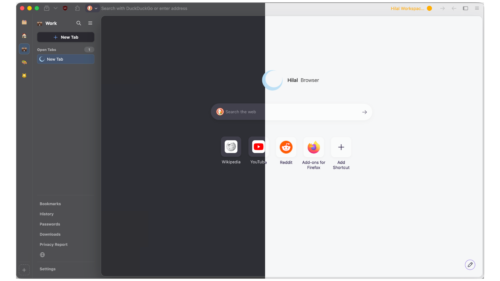

# Hilal Browser

<p align="center">
  
</p>

<p align="center">
  <a href="https://github.com/VastSea0/hilal-browser/releases"></a>
  <a href="https://github.com/VastSea0/hilal-browser/actions/workflows/verify-patches.yml"></a>
  <a href="https://discord.gg/JZJ4tmPHFw"></a>
  <a href="LICENSE"></a>
</p>

<p align="center">
  
</p>

Hilal is an experimental desktop browser built on Firefox, focused on vertical tabs, isolated workspaces, and practical defaults. It uses Gecko and remains compatible with Firefox extensions.

The project is in alpha and was previously developed as Huma Browser.

## Highlights

- Collapsible vertical tabs
- Workspaces with separate container contexts
- uBlock Origin included by default
- Search bangs in the address bar
- Telemetry disabled by default
- Compact mode and per-site CSS tools
- Native translucent chrome on macOS

## Download

Downloads are available from the [releases page](https://github.com/VastSea0/hilal-browser/releases).

## Build from source

Install the [Firefox build prerequisites](https://firefox-source-docs.mozilla.org/setup/index.html) for your platform first. Rust is also required to compile the `hil` patch manager.

```bash
git clone https://github.com/VastSea0/hilal-browser.git
cd hilal-browser

cargo build --release --manifest-path hil/Cargo.toml
mkdir -p bin
cp hil/target/release/hil bin/hil

./bin/hil setup
./bin/hil apply
```

Then run the build script for your platform:

```bash
scripts/build-macos.sh
scripts/build-linux.sh
```

On Windows, use `.\scripts\build-windows.ps1`. See [docs/BUILD-WINDOWS.md](docs/BUILD-WINDOWS.md) for the required environment and setup steps.

## Development

This repository contains the Hilal-specific patches, overlays, and build tooling. The Firefox source checkout is created in the gitignored `engine/` directory.

```text
changes/        patches and overlay files
manifest.toml   patch and overlay order
upstream.lock   pinned Firefox revision
engine/         local Firefox checkout
```

Source changes are made in `engine/`. Run `./bin/hil refresh` afterward to regenerate the files under `changes/`, then review and commit those files in this repository.

The complete patch workflow, including conflict resolution, is documented in [docs/WORKFLOW.md](docs/WORKFLOW.md). Other build, release, localization, and upstream sync notes live in [`docs/`](docs/).

## Star History

<a href="https://www.star-history.com/?repos=VastSea0%2Fhilal-browser&type=timeline&legend=top-left">
  <picture>
    <source media="(prefers-color-scheme: dark)" srcset="https://api.star-history.com/chart?repos=VastSea0/hilal-browser&type=timeline&theme=dark&legend=top-left" />
    <source media="(prefers-color-scheme: light)" srcset="https://api.star-history.com/chart?repos=VastSea0/hilal-browser&type=timeline&legend=top-left" />
    
  </picture>
</a>

## License

Hilal's patches, scripts, and other source files are available under the [Mozilla Public License 2.0](LICENSE). Branding assets are copyright Hilal Browser contributors.
